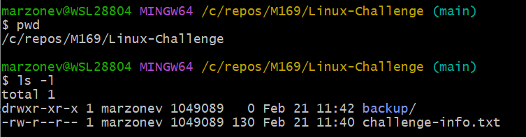

# KN 01

## A) Git Client installieren und einrichten

### Gitbash ist korrekt konfiguriert

### git --version und git help funktioniert

## B) SSH Keypair erstellen und konfigurieren

### Ein SSH-Keypair wurde erfolgreich erstellt

### Der SSH-Key wurde dem SSH-Agent persistent hinzugefügt

Inhalt der .bash_profile Datei.

### Der Public Key ist korrekt bei GitLab hinterlegt

### Die Kommandos ssh-add -l und ssh -T git@gitlab.com werden vom System ohne Fehlermeldung beantwortet.

Ich habe Github anstatt Gitlab verwendet.

## C) Neues Gitlab Repository erstellen und mit Client verknüpfen

### Repo und Struktur erstellt

### Befehle

## Basic Linux Commands

