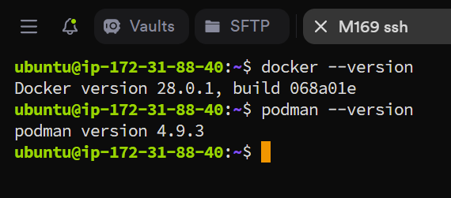
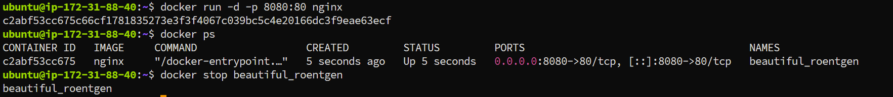
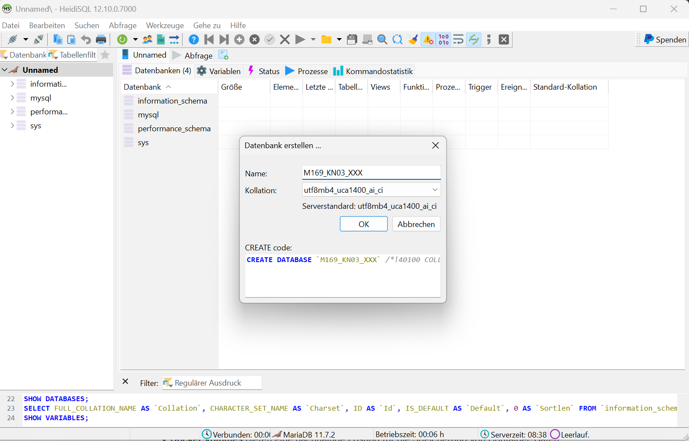
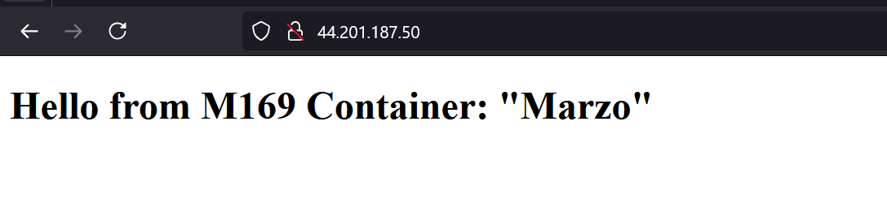

# KN 03

## A) Aufsetzen der EC2-Instanz mit IaC-Code - AWS LEARNER LAB

### 1. Teil-Challenge

#### SSH Zugriff / Docker und Podman



#### Unterschied zwischen Docker und Podman

Podman ist von Haus aus rootless-fähig, d.h. Container können ohne Root-Rechte gestartet werden, was das System sicherer macht. Bei Docker gibt es auch einen Rootless Mode dieser muss aber zuert konfigueriert werden.

Bei Podman gibt es nicht einen dauernd laufenden Daemon-Prozess sondern jeder Container läuft als eigener Prozess. Weniger Angriffsfläche, da es nicht einen dauernd laufenden Prozess gibt.

## B) OCI-Images, Container und Registry - BASICS

### 2. Teil-Challenge

#### Grundlegende Docker Befehle



#### Unterschied zwischen Docker und VMs

Bei einer VM wird eine ganze Maschine virtuallisiert (Kernel, Hardware usw...)

Beim Container wird nur die Applikation virtuallisiert inklusive Abhängigkeiten. Container verwenden dabei den Kernel des Hosts.

#### Unterschied zwischen Images und Container

Images sind eigentlich Vorlagen für die Erstellung von Containern. Dort sind Abhängikeiten und Anweissungen Bibliotheken und Anweisungen für die Anwendung.

Container werden dann aufgrund dieser Anweisungen aufgesetzt.

#### Warum ist eine Registry wie Docker Hub wichtig?

Eine Registry wie Docker Hub ist wichtig, weil sie eine zentrale Plattform zum Speichern, Verwalten und Teilen von Container-Images bietet. Sie erleichtert die Verteilung, Wiederverwendung und Automatisierung von Images, unterstützt CI/CD-Prozesse, verbessert die Sicherheit und ermöglicht eine effiziente Zusammenarbeit in Teams.

#### Vorteile isolation Container

## C) OCI-Images mit Docker - RUN & ADMINISTRATION

### 3. Teil-Challenge

#### Docker Commands

##### Ungebrauchte Volumes löschen

``` docker
docker volume prune
```

##### Volume erstellen

``` docker
docker volume create mydbstore
```

##### Mariadb Container mit dem Volume erstellen

``` docker
docker run --detach --name some-mariadb --env MARIADB_ROOT_PASSWORD=my-secret-pw -v mydbstore:/var/lib/mysql -p 3306:3306 mariadb:latest
```

##### In Mariadb Datenbank erstellen



##### Wechsel in den Container

``` docker
docker exec -it <Container-ID> /bin/bash
```

#### Unterschied persistent/non-persistent

Bei persistent Volumes wird dieses nach der Löschung des Containers nicht mitgelöscht. Das Volume kann dann wieder von einem anderen Container verwendet werden.

Ist gut wenn z.B. auf eine neue Version geupdated wird oder wenn ein Volume von mehrere Containern gebraucht wird.

## D) OCI-Images mit Docker - BUILD & CUSTOMIZATION

### 4. Teil-Challenge


