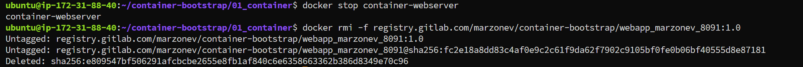

# KN 04

## A) Docker Image aufsetzen, in Registry ablegen und deployen - OCI: BASIC WORKFLOW

### 1. Teil-Challenge

#### Beweis, dass KEIN OCI-Image auf der AWS-Instanz liegt

#### Personifiziertes Container-Image Ihrer AWS-VM starten (OCI-Image muss vom Gitlab-Repo ge"downloaded" werden)

#### Via Webbrowser vom eigenen Laptop darauf zugreifen

#### Container stoppen und dann Image löschen (Funktioniert das? Begründung)

Das funktioniert aber nur wegen dem Parameter -f, dieser forced das löschen. Eigentlich würde das löschen blockiert werden, da ein Container dieses Image noch verwendet.

## B) Docker Compose - Container Orchestrierung mit mehreren Services - CONTAINER MANAGEMENT: ENTRY-LEVEL

### 2. Teil-Challenge

#### Beweis, dass die gesamte Umgebung gelöscht ist

#### Starten Sie ihren angepassten Dienst mit $ docker compose up

#### Via Webbrowser vom eigenen Laptop darauf zugreifen

#### Zeigen Sie, in welchem Verzeichnis auf der Instanz die Volume-Daten abgelegt werden und welche internen IP-Adressen inkl. CIDR die beiden Container erhalten haben

Das Volume ist unter "/var/lib/docker/volumes/02_compose_mar-vol/_data" gemounted

Der Webserver hat die IP: 172.18.0.2/16

Die Datenbank hat die IP 172.18.0.3/16

#### Löschen Sie den gesamten Dienst wieder

#### Published Port: 5169, Target Port: 8169

