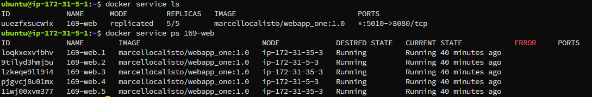

# KN 04

## A) Docker Image aufsetzen, in Registry ablegen und deployen - OCI: BASIC WORKFLOW

### 1. Teil-Challenge

#### Beweis, dass KEIN OCI-Image auf der AWS-Instanz liegt

#### Personifiziertes Container-Image Ihrer AWS-VM starten (OCI-Image muss vom Gitlab-Repo ge"downloaded" werden)

#### Via Webbrowser vom eigenen Laptop darauf zugreifen

#### Container stoppen und dann Image löschen (Funktioniert das? Begründung)

Das funktioniert aber nur wegen dem Parameter -f, dieser forced das löschen. Eigentlich würde das löschen blockiert werden, da ein Container dieses Image noch verwendet.

## B) Docker Compose - Container Orchestrierung mit mehreren Services - CONTAINER MANAGEMENT: ENTRY-LEVEL

### 2. Teil-Challenge

#### Beweis, dass die gesamte Umgebung gelöscht ist

#### Starten Sie ihren angepassten Dienst mit $ docker compose up

#### Via Webbrowser vom eigenen Laptop darauf zugreifen

#### Zeigen Sie, in welchem Verzeichnis auf der Instanz die Volume-Daten abgelegt werden und welche internen IP-Adressen inkl. CIDR die beiden Container erhalten haben

Das Volume ist unter "/var/lib/docker/volumes/02_compose_mar-vol/_data" gemounted

Der Webserver hat die IP: 172.18.0.2/16

Die Datenbank hat die IP 172.18.0.3/16

#### Löschen Sie den gesamten Dienst wieder

#### Published Port: 5169, Target Port: 8169

## C) Docker Swarm Cluster aufsetzen - SETUP HIGH AVAILABILITY PLATFORM

### IP Matrix

| EC2 Instant | AZ (ändert) | Private IP (Fix) | Role    |
| :---------- | :---------- | :--------------- | ------- |
| M169_Node1  | us-east-1a  | 172.31.5.1       | Manager |
| M169_Node2  | us-east-1a  | 172.31.5.2       | Manager |
| M169_Node3  | us-east-1d  | 172.31.35.1      | Manager |
| M169_Node4  | us-east-1a  | 172.31.5.3       | Worker  |
| M169_Node5  | us-east-1d  | 172.31.35.3      | Worker  |

### 3. Teil-Challenge

#### Beweis, dass 5 Nodes (3 Manager-Nodes, 2 Worker-Nodes) existieren

#### Verfügbarkeit: Sowohl die Manager-Nodes als auch die Worker-Nodes sind über mehrere AZs verteilt

## D) Docker Swarm Imperativ - CONTAINER ORCHESTRATION: ENTRY-LEVEL

### 4. Teil-Challenge

#### Erstellen Sie nun mit der imperativen Methode (gemäss Tutorial oben) einen eigenen Service mit neuen Bedingungen (unten aufgelistet)

#### Ergänzen Sie die bestehenden 5 Container mit 5 weiteren. Nutzen Sie dazu den Befehl docker service scale und ergänzen Sie diesen so, dass anschliessend 10 Container verteilt auf zwei Worker-Nodes laufen

Hier sieht man das die unter 5 neu erstellt wurden, da diese erst seit 12 Sekunden aktiv sind.

#### Checken Sie nun, ob und wie die  10 Container auf den beiden Worker-Nodes verteilt sind (Wechseln Sie dazu auf die Terminals von Worker-Node 4 und 5) - mit docker container ls sehen sie, dass diese gleichmässig verteilt sind

##### Node 4

##### Node 5

#### Löschen Sie nun 3 Container auf dem Worker-Node 4 (Wechseln Sie dazu auf das Terminal von Worker-Node 4)

#### Checken Sie nun auf einem Manager-Node mit docker service.... Erklären Sie folgende Fragen:

##### Wieviele Container sollten es gemäss Desired State sein?

Gemäss Desired State sollten es 10 Container sein

##### Wieviele Container sind es gemäss Observed State?

Es sind 10 Container gestartet

##### Sind die Container gleichmässig auf den Worker-Nodes verteilt?

Ja sie sind gleichmässig verteilt. Das sieht man unter dem Abschnitt Node

##### Was ist passiert, nachdem Sie die drei Container auf Worker-Node4 gelöscht haben?

Es hat automatisch 3 weiter Container gestartet, da es dauerhaft versucht den Desired State zu erreichen.

##### Wie nennt man diesen Prozess in der Fachsprache?

Self-Healing

#### Lab beenden: Wenn die Schritte oben abgeschlossen, dokumentiert und verstanden sind, können Sie das Lab löschen.

