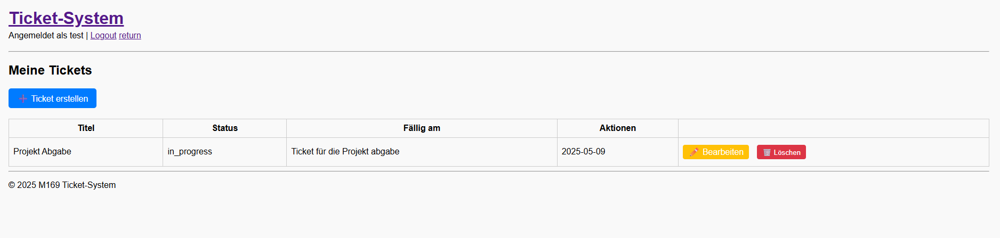
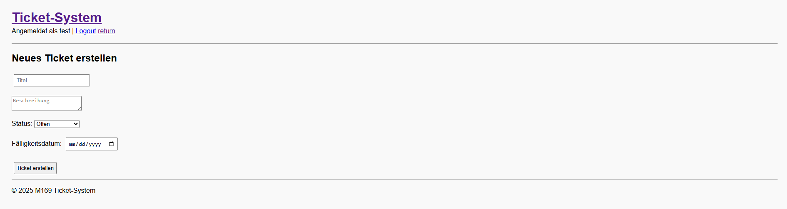
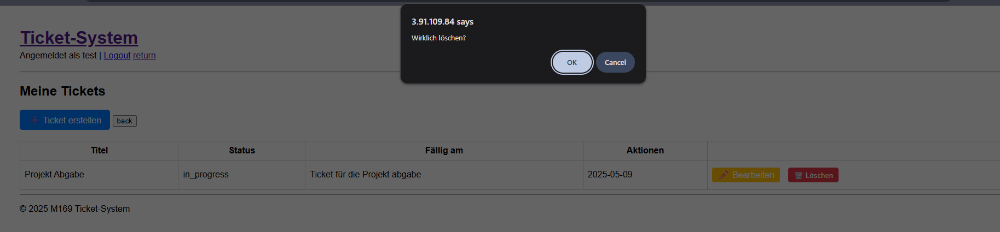
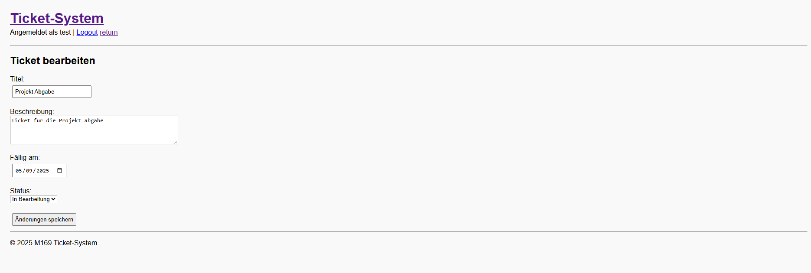
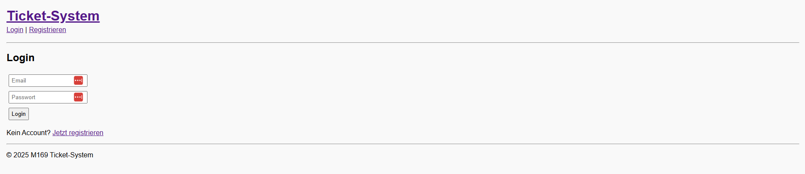
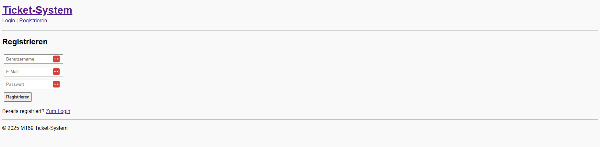

# 📝 M169 Notizen-Web-App

Dies ist die Dokumentation zur containerisierten **Todo-Liste mit DB im Hintergrund**, entwickelt im Rahmen des Moduls **M169**.

Unsere Web-Applikation ermöglicht es Benutzerinnen und Benutzern, Aufgaben (ToDos) zu erstellen, als erledigt zu markieren oder zu löschen. Die Anwendung ist vollständig containerisiert und basiert auf PHP, welches über einen NGINIX-Webserver läuft. Die Aufgaben werden in einer PostgreSQL-Datenbank gespeichert, die beim Start mit einem init.sql-Skript initialisiert wird.

---

## 🚧 Tech-Stack

| Komponente         | Technologie               |
| ------------------ | ------------------------- |
| Frontend           | PHP + NGINX               |
| Datenbank          | PostgreSQL                |
| Orchestrierung     | Docker Compose            |
| Container Registry | Github Container Registry |

---

## ⚙️ Features

- Eine containerisierte ToDo-Web-App mit PHP und PostgreSQL.
- Die Anwendung ermöglicht das Erstellen, Anzeigen und Löschen von Aufgaben direkt über das PHP-Frontend ohne REST API.
- Die gesamte Applikation wird per Docker Compose aufgebaut und im GitLab-Repository mit verständlicher Dokumentation versioniert.


## App Vorschau

Zugriffslink wenn Applikation läuft -> http://3.91.109.84/ticket/index.php











## Datenbank

Die Datenbank wird durch ein verändertes postgresql image erstellt. Das Image enthält bereits Logindaten zur Datenbank und ein init.sql welches beim ersten Start des Containers alle Tabellen erstellt.

### init.sql

Hier ist das init.sql welches für die automatische Initialisierung der Datenbank ist.

``` sql
-- init.sql

-- Nutzer-Tabelle
CREATE TABLE users (    -- Erstellt die Tabelle "users"
    id SERIAL PRIMARY KEY,    -- Erstellt den Primary Key welcher automatisch zählt
    username VARCHAR(50) UNIQUE NOT NULL,   -- Erstellt das Attribut username. Enthält den Username welcher oben Links auf der Seite angezeigt wird.
    email VARCHAR(100) UNIQUE NOT NULL,    -- Erstellt das Attribut email. Enthält die email fürs login.
    password TEXT NOT NULL,    --Erstellt das Attribut password. Enthält das Passwort fürs login.
    created_at TIMESTAMP DEFAULT CURRENT_TIMESTAMP    -- Macht einen Timestamp wann das login erstellt wurde.
);

-- Ticket-Tabelle
CREATE TABLE tickets (    -- Erstellt die Tabelle "users"
    id SERIAL PRIMARY KEY,    -- Erstellt den Primary Key welcher automatisch zählt
    user_id INTEGER REFERENCES users(id) ON DELETE CASCADE,    -- Foreign Key der Tabelle users
    title VARCHAR(100) NOT NULL,    -- Erstellt das Attribut title. Enthält den Title des Tasks
    description TEXT,    -- Erstellt das Attribut title. Enthält die Beschreibung des Tasks
    status VARCHAR(20) DEFAULT 'open',    -- Erstellt das Attribut status. Definiert ob der Tasks offen oder geschlossen ist.
    created_at TIMESTAMP DEFAULT CURRENT_TIMESTAMP,    -- Erstellt ein Timestamp wann der Task erstellt wurde.
    due_date DATE    -- Erstellt das Attribut due_date. Enthält das Enddatum für den Task.
);
```

[init.sql](app/db/init.sql)

### Tabellenstruktur

#### Tabelle: users

| Spalte     | Typ          | Eigenschaften                         |
| ---------- | ------------ | ------------------------------------- |
| id         | SERIAL       | Primärschlüssel, automatisch steigend |
| username   | VARCHAR(50)  | Eindeutig, nicht NULL                 |
| email      | VARCHAR(100) | Eindeutig, nicht NULL                 |
| password   | TEXT         | Nicht NULL (gehashter Wert)           |
| created_at | TIMESTAMP    | Standardwert: CURRENT_TIMESTAMP       |

---

#### Tabelle: tickets

| Spalte      | Typ          | Eigenschaften                                   |
| ----------- | ------------ | ----------------------------------------------- |
| id          | SERIAL       | Primärschlüssel, automatisch steigend           |
| user_id     | INTEGER      | Fremdschlüssel auf users(id), ON DELETE CASCADE |
| title       | VARCHAR(100) | Nicht NULL                                      |
| description | TEXT         | Optional                                        |
| status      | VARCHAR(20)  | Default: 'open', z.B. open / in_progress / done |
| created_at  | TIMESTAMP    | Standardwert: CURRENT_TIMESTAMP                 |
| due_date    | DATE         | Optional                                        |

---

#### Beziehung

- Ein `user` kann mehrere `tickets` haben (1:n)
- Jedes `ticket` gehört genau zu einem `user`

## PHP Applikation

Unsere Web-Applikation wurde mit drei verschiedenen Technologien entwickelt:

- **PHP** (Backend – ermöglicht die Verbindung zur Datenbank)
- **HTML** (Frontend, kann dynamisch von PHP generiert werden )
- **CSS** (Design für das HTML)

Die Web-Applikation besteht grundsätzlich aus zwei Teilen:

1. **Applikation** – sichtbar für Benutzer
2. **Authentifikation** – serverseitig, nicht direkt sichtbar

---

### Authentifikation

Der Authentifikationsbereich umfasst vier PHP-Dateien, die eine sichere Sitzung (Session) für Benutzer ermöglichen.

#### `login.php`

- Ermöglicht den Login mit registrierter E-Mail und Passwort.
- Gültige Anmeldedaten führen zu einer aktiven Session.

#### `register.php`

Benutzerregistrierung mit folgenden Regeln:

- Benutzername ist einzigartig.
- E-Mail wurde noch nicht verwendet.
- Passwort ist ausgefüllt.

#### `session.php`

- Startet eine PHP-Session.
- Leitet Benutzer zur Login-Seite um, wenn keine Benutzerdaten in der Session gefunden wurden.

#### `logout.php`

- Beendet die aktuelle Session.
- Entfernt alle Session-Daten (z. B. Benutzerinformationen).

---

###  Applikation
#### Ordnerstrucktur
``` 
app/ 
├── .vscode/ 
├── backend/ 
│ ├── auth/ 
│ │ ├── login.php 
│ │ ├── logout.php 
│ │ ├── register.php 
│ │ └── session.php 
│ ├── ticket/ 
│ │ ├── create.php 
│ │ ├── delete.php 
│ │ └── edit.php 
│ ├── index.php 
│ ├── db.php 
│ ├── Dockerfile 
│ ├── footer.php 
│ ├── header.php 
│ └── style.css 
├── db/ 
│ ├── Dockerfile 
│ └── init.sql 
├── nginx/ 
├── docker-compose.yml 
└── .gitignore 
```
#### Datenbankverbindung

- Zentrale Datei: `db.php`
- Enthält alle Verbindungsinformationen zur Datenbank.

#### Konsistente Struktur

- Gemeinsame Layout-Dateien:
  - `header.php`: enthält Referenz zu `db.php`, essenziell für Datenbankzugriff.
  - `footer.php`: gemeinsamer Footer für alle Seiten.

#### Styling

- Globale Styles: `style.css` im Root-Verzeichnis
- Gilt für alle HTML-Elemente und sorgt für ein konsistentes Design.

---

###  Tasks

Alle To-do-Funktionen befinden sich im Verzeichnis: `ticket/`.

####  Funktionsumfang (CRUD)

- **Create** – Neues Ticket anlegen
- **Read** – Tickets anzeigen
- **Update** – Bestehende Tickets bearbeiten
- **Delete** – Tickets löschen

#### Hauptseite: `index.php`

- Zeigt alle To-dos des aktuell eingeloggten Benutzers dynamisch an.
- Jeder Eintrag hat Buttons für:
  - Bearbeiten (`edit.php`)
  - Löschen (`delete.php`)

---

####  Erstellseite: `create.php`

- Enthält ein Formular zum Erstellen eines neuen Tickets.
- **Pflichtfelder:**
  - Titel/Name (muss eindeutig sein)
  - Fälligkeitsdatum
  - Status (eine von drei Optionen):
    - `Open`
    - `In Work`
    - `Closed`
- **Optional:**
  - Beschreibung

---

#### Editierseite: `edit.php`

- Erlaubt das Ändern eines bestehenden Tickets.
- Jeder Ticket-Eintrag auf der Hauptseite enthält einen Link zu dieser Seite.

---

####  Löschfunktion: `delete.php`

- Jeder Ticket-Eintrag enthält einen Button zum Löschen.
- Vor dem Löschen wird eine **Bestätigung (Confirm)** abgefragt, um versehentliches Löschen zu vermeiden.
## Compose.yml
```yml
version: '3.8'

services:
  php:
    image: ghcr.io/marzonev/m169-php:latest
    container_name: m169-php
    volumes:
      - ./backend:/var/www/html
    ports:
      - "80:80"  # Apache läuft auf Port 80
    depends_on:
      - db

  db:
    image: ghcr.io/marzonev/m169db:latest
    container_name: m169_postgres
    ports:
      - "5432:5432"
    volumes:
      - pgdata:/var/lib/postgresql/data

  pgadmin:
    image: dpage/pgadmin4
    environment:
      PGADMIN_DEFAULT_EMAIL: admin@example.com
      PGADMIN_DEFAULT_PASSWORD: admin
    ports:
      - "5050:80"

volumes:
  pgdata:

```
