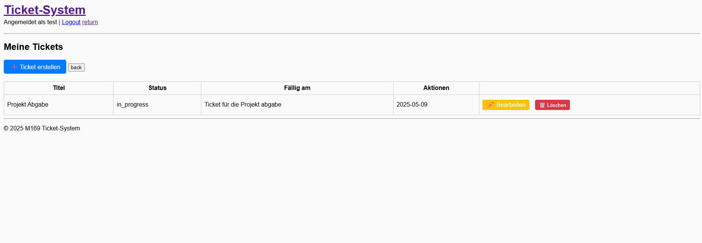

# 📝 M169 Notizen-Web-App

Dies ist die Dokumentation zur containerisierten **Todo-Liste mit DB im Hintergrund**, entwickelt im Rahmen des Moduls **M169**.

Unsere Web-Applikation ermöglicht es Benutzerinnen und Benutzern, Aufgaben (ToDos) zu erstellen, als erledigt zu markieren oder zu löschen. Die Anwendung ist vollständig containerisiert und basiert auf PHP, welches über einen NGINIX-Webserver läuft. Die Aufgaben werden in einer PostgreSQL-Datenbank gespeichert, die beim Start mit einem init.sql-Skript initialisiert wird.

---

## 🚧 Tech-Stack

| Komponente         | Technologie               |
| ------------------ | ------------------------- |
| Frontend           | PHP + NGINX               |
| Datenbank          | PostgreSQL                |
| Orchestrierung     | Docker Compose            |
| Container Registry | Github Container Registry |

---

## ⚙️ Features

- Eine containerisierte ToDo-Web-App mit PHP und PostgreSQL.
- Die Anwendung ermöglicht das Erstellen, Anzeigen und Löschen von Aufgaben direkt über das PHP-Frontend ohne REST API.
- Die gesamte Applikation wird per Docker Compose aufgebaut und im GitLab-Repository mit verständlicher Dokumentation versioniert.


## App Vorschau



## Datenbank

Die Datenbank wird durch ein verändertes postgresql image erstellt. Das Image enthält bereits Logindaten zur Datenbank und ein init.sql welches beim ersten Start des Containers alle Tabellen erstellt.

### init.sql

Hier ist das init.sql welches für die automatische Initialisierung der Datenbank ist.

``` sql
-- init.sql

-- Nutzer-Tabelle
CREATE TABLE users (    -- Erstellt die Tabelle "users"
    id SERIAL PRIMARY KEY,    -- Erstellt den Primary Key welcher automatisch zählt
    username VARCHAR(50) UNIQUE NOT NULL,   -- Erstellt das Attribut username. Enthält den Username welcher oben Links auf der Seite angezeigt wird.
    email VARCHAR(100) UNIQUE NOT NULL,    -- Erstellt das Attribut email. Enthält die email fürs login.
    password TEXT NOT NULL,    --Erstellt das Attribut password. Enthält das Passwort fürs login.
    created_at TIMESTAMP DEFAULT CURRENT_TIMESTAMP    -- Macht einen Timestamp wann das login erstellt wurde.
);

-- Ticket-Tabelle
CREATE TABLE tickets (    -- Erstellt die Tabelle "users"
    id SERIAL PRIMARY KEY,    -- Erstellt den Primary Key welcher automatisch zählt
    user_id INTEGER REFERENCES users(id) ON DELETE CASCADE,    -- Foreign Key der Tabelle users
    title VARCHAR(100) NOT NULL,    -- Erstellt das Attribut title. Enthält den Title des Tasks
    description TEXT,    -- Erstellt das Attribut title. Enthält die Beschreibung des Tasks
    status VARCHAR(20) DEFAULT 'open',    -- Erstellt das Attribut status. Definiert ob der Tasks offen oder geschlossen ist.
    created_at TIMESTAMP DEFAULT CURRENT_TIMESTAMP,    -- Erstellt ein Timestamp wann der Task erstellt wurde.
    due_date DATE    -- Erstellt das Attribut due_date. Enthält das Enddatum für den Task.
);
```

[init.sql](app/db/init.sql)

### Tabellenstruktur

#### Tabelle: users

| Spalte     | Typ          | Eigenschaften                         |
| ---------- | ------------ | ------------------------------------- |
| id         | SERIAL       | Primärschlüssel, automatisch steigend |
| username   | VARCHAR(50)  | Eindeutig, nicht NULL                 |
| email      | VARCHAR(100) | Eindeutig, nicht NULL                 |
| password   | TEXT         | Nicht NULL (gehashter Wert)           |
| created_at | TIMESTAMP    | Standardwert: CURRENT_TIMESTAMP       |

---

#### Tabelle: tickets

| Spalte      | Typ          | Eigenschaften                                   |
| ----------- | ------------ | ----------------------------------------------- |
| id          | SERIAL       | Primärschlüssel, automatisch steigend           |
| user_id     | INTEGER      | Fremdschlüssel auf users(id), ON DELETE CASCADE |
| title       | VARCHAR(100) | Nicht NULL                                      |
| description | TEXT         | Optional                                        |
| status      | VARCHAR(20)  | Default: 'open', z.B. open / in_progress / done |
| created_at  | TIMESTAMP    | Standardwert: CURRENT_TIMESTAMP                 |
| due_date    | DATE         | Optional                                        |

---

#### Beziehung

- Ein `user` kann mehrere `tickets` haben (1:n)
- Jedes `ticket` gehört genau zu einem `user`

## PHP Applikation

Unsere Web-Applikation  wurde mit 3 verschiedenen Technologieen entwickelt
- php (Backend- die verbindung zur Datenbank ermöglicht)
- html (Frontend, das auch dynamisch vom php generiert werden kann)
- css (Style für das html)

Die Web-Applikation besteht grundsätzlich aus 2 Teilen, Front-end und Back-end.
Das einte ist sichtbar für den Benutzer, während das andere nur Serversided ist.

### Backend
Im Backend haben wir verschiedene Funktionen, wobei die wichtigste, die Verbindung zur Datenbank ist.

In der Datei ``db.php`` stehen alle Verbindungsinformationen, damit sich die Web-applikation überhaupt mit der Datenbank verbinden kann.

Zusätzlich haben wir noch einheitliche Footer und Header, um Konsistenz zu gewährleisten. Dies befindet sich in den Dateien ``footer.php`` und ``header.php``

Zuletzt haben wir im Root Verzeichnis noch das Globale CSS file, ``style.css``, dort drin stehen alle Designs, die das HTML übernimmt, um eine Schöne Seite darstellen zu können.

---
### Tasks
Alle Funktionen, die direkt etwas mit der To-do Funktion der Applikation zu tun haben, sind im `ticket/` Ordner zu finden.
Grundsätzlich sind alle `CRUD` Funktionen verfügbar.

Die Hauptsite findet man unter `index.php`. Dort werden alle To-dos, die dem eingeloggten User gehören, dynamisch angezeigt.

Man findet auch die Knöpfe, die einen auf die Bearbeitungs-seite weiterleiten, und das löschen erlauben.

## Compose.yml
```yml
version: '3.8'

services:
  php:
    build: ./backend
    container_name: m169-php
    volumes:
      - ./backend:/var/www/html
    ports:
      - "80:80"  # Apache läuft auf Port 80
    depends_on:
      - db

  db:
    image: ghcr.io/marzonev/m169db:latest
    container_name: m169_postgres
    ports:
      - "5432:5432"
    volumes:
      - pgdata:/var/lib/postgresql/data

  pgadmin:
    image: dpage/pgadmin4
    environment:
      PGADMIN_DEFAULT_EMAIL: admin@example.com
      PGADMIN_DEFAULT_PASSWORD: admin
    ports:
      - "5050:80"

volumes:
  pgdata:

```
